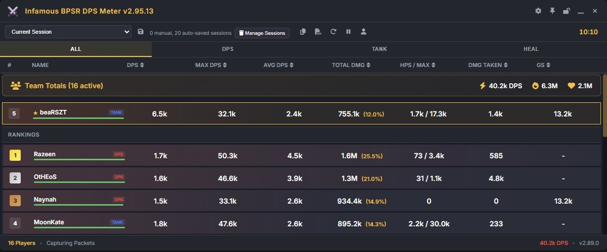
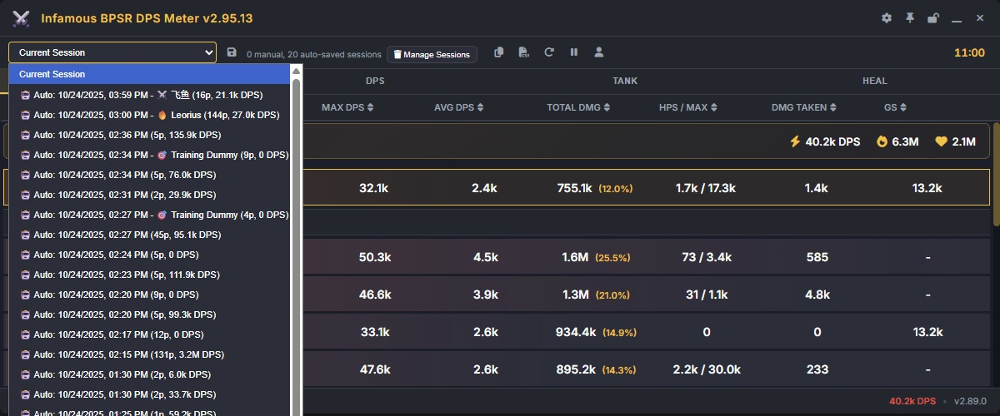
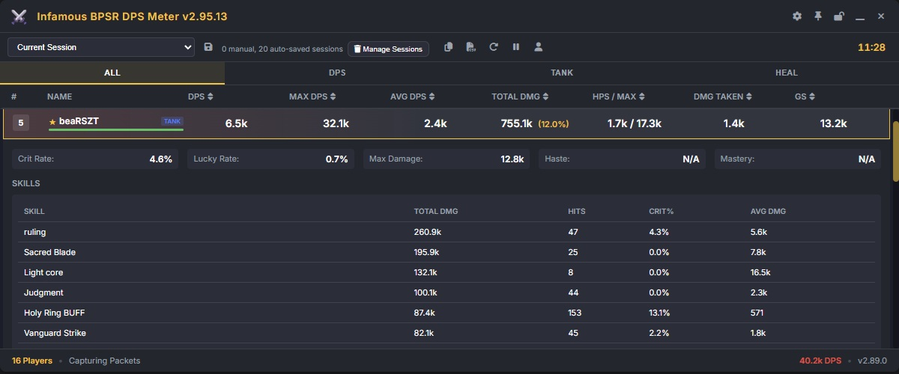

# ⚔️ Infamous BPSR DPS Meter v3.1.87

**The Ultimate Blue Protocol Combat Tracker** - Real-time DPS/HPS analysis with modern UI

[](LICENSE)
[](https://github.com/ssalihsrz/InfamousBPSRDPSMeter)
[](#installation)
[](https://github.com/ssalihsrz/InfamousBPSRDPSMeter/releases)

> **🌟 Original Project:** [StarResonanceDamageCounter](https://github.com/dmlgzs/StarResonanceDamageCounter) by dmlgzs  
> **🔱 Forked From:** [NeRooNx/BPSR-Meter](https://github.com/NeRooNx/BPSR-Meter)  
> **📊 BPSR Logs:** [winjwinj/bpsr-logs](https://github.com/winjwinj/bpsr-logs)
> 
> This enhanced edition builds upon excellent work from the Blue Protocol community with improved stability, session management, and extended features.

---

## 🚀 Quick Start (For Users)

### 📥 Download & Install

**Step 1: Download the Latest Release**
- 🔗 **[Download Installer](https://github.com/ssalihsrz/InfamousBPSRDPSMeter/releases/latest)** ← Click here!
- Get: `InfamousBPSRDPSMeter-Setup-3.1.52.exe` (~90MB)
- 🆕 **Auto-Update:** v3.1.52+ includes automatic update notifications from GitHub!

**Step 2: Install Npcap (Required)**
- Download from: https://npcap.com/
- Right-click installer → **"Run as Administrator"** (required for API option to show!)
- ✅ Check **"Install Npcap in WinPcap API-compatible Mode"**
- Complete installation and restart your computer

**Step 3: Install the Meter**
- Right-click the `.exe` → **"Run as Administrator"**
- Follow the installation wizard
- Creates desktop + start menu shortcuts

**Step 4: Launch & Use**
- Run **Infamous BPSR DPS Meter** (as Administrator recommended)
- Start or join Blue Protocol
- Change instance/channel once to trigger packet capture
- Meter will automatically track combat data!

### 💡 Quick Tips
- ⚡ Works best with **VPN disabled** (100% accuracy)
- 🔄 First launch may require changing game instance once
- 📊 Click any player row to see detailed skill breakdown
- 💾 Sessions auto-save - switch between encounters via dropdown
- 📋 Copy stats to clipboard with one click

---

## 👨‍💻 For Developers

### 🔧 Build Instructions

**Recommended: WSL → Windows Hybrid Build**  
Development in WSL, building on Windows for best compatibility.

#### Quick Build (from WSL):
```bash
# From WSL terminal in project directory
bash build-from-wsl.sh
```

**What this does:**
1. Copies source from WSL to Windows temp directory
2. Installs dependencies on Windows (pnpm)
3. Builds Windows installer using electron-builder
4. Copies installer back to WSL and F:/DPS
5. Auto-detects version from package.json

#### Manual Build (Windows Native):
```cmd
# Run in Windows Command Prompt (as Administrator)
pnpm install
pnpm dist
```

#### Prerequisites:
- **Node.js:** v3.1.52+ (Windows)
- **pnpm:** Latest version
- **Windows 10/11:** Build must run on Windows
- **Code signing:** Certificate installed for signing .exe

📖 **Detailed Instructions:** [DEVELOPMENT.md](DEVELOPMENT.md)

### ⚠️ VPN Limitations
**VPNs interfere with packet capture - use with caution**

- ❌ **Not Recommended** - VPNs encrypt/redirect packets causing unreliable data
- ⚠️ **ExitLag** - "Legacy - NDIS" mode has partial compatibility (~70-80% accuracy)
- ❌ **Kernel-Level VPNs** - Completely incompatible (packets encrypted before capture)
- ✅ **Best Practice** - Disable VPN when using meter for 100% accuracy
- 💡 **Auto-Detection** - Automatically selects adapter with most traffic

**Note:** VPN compatibility is experimental. Data may be incomplete or inaccurate when VPN is active. For best results, disable VPN during combat analysis.

---

## 🌟 What Makes This Special?

This project builds upon and combines excellent work from the Blue Protocol community:
- ✨ **Modern UI** - Clean glassmorphism design with intuitive controls
- ⚡ **Robust Engine** - Accurate DPS/HPS tracking with proper packet parsing
- 🔧 **Performance** - Optimized rendering and window management
- 📊 **Enhanced Features** - Session management, player details, flexible exports
- 🌍 **English Localization** - Full translation for global players

---

# 🙏 Acknowledgments and Credits

## Project Lineage

This project is part of a community-driven evolution:

1. **🌟 Original Foundation** - [dmlgzs/StarResonanceDamageCounter](https://github.com/dmlgzs/StarResonanceDamageCounter)
   - Created the initial DPS meter architecture
   - Established packet capture methodology
   
2. **🎨 Modern UI Fork** - [NeRooNx/BPSR-Meter](https://github.com/NeRooNx/BPSR-Meter)
   - Beautiful glassmorphism UI design
   - Enhanced visual experience
   - Improved user interface
   
3. **⚔️ This Enhanced Edition** - Infamous BPSR DPS Meter
   - Forked from NeRooNx's version
   - Added stability and reliability improvements
   - Session management system
   - Player detail expansion
   - Flexible export options
   - Auto-resize and window fixes

## Individual Contributors

- **dmlgzs** - Original project creator and packet parsing foundation
- **NeRooNx** - Modern UI design and visual improvements
- **winjwinj** - Skill data and translations from [bpsr-logs](https://github.com/winjwinj/bpsr-logs)
- **Community Contributors** - Bug reports, testing, feedback, and suggestions

## License & Attribution

This project maintains the **AGPL-3.0** license from the original work and gives full credit to all contributors in the development chain.

Thank you to all the talented developers who made this possible! 💙

---

# BPSR Meter - DPS Meter for Blue Protocol

BPSR Meter is a desktop application that acts as a real-time DPS (Damage Per Second) meter for Blue Protocol. It overlays the game window to provide detailed combat statistics without interrupting your gameplay.

## 📸 Screenshots

### Main Interface

*Real-time DPS tracking with player rankings, damage percentages, and role indicators*

### Session Management

*Auto-saved sessions with easy switching between different encounters*

### Player Details & Skill Breakdown

*Detailed skill analysis with damage breakdown, crit rates, and hit counts*

## ✨ Enhanced Features

### Core Features
1.  **Player Name:** Your identifier in the meter
2.  **Current/Max Health:** Visual health bar with color coding
3.  **DPS (Damage Per Second):** Real-time damage dealt per second
4.  **HPS (Healing Per Second):** Real-time healing done per second
5.  **Total Damage:** Accumulated damage in encounter
6.  **Damage Taken:** Total damage received during combat
7.  **Contribution %:** Your percentage of the group's total damage
8.  **Total Healing:** Accumulated healing in encounter
9.  **GS (Gear Score):** Equipment and skill score

### Enhanced UI Features
- 🥇 **Rank Badges** - Gold/Silver/Bronze for top 3 players
- 💙 **Local Player Highlighting** - Blue glow on your character with pulsing animation
- 🎨 **Position Gradient** - Background colors from red (#1) to blue (#10)
- 📊 **Nearby/Solo Modes** - View top 10 or just yourself
- 🔄 **Multi-Metric Sorting** - Sort by DMG, TANK, or HEAL
- ⚡ **Smooth Animations** - Professional transitions and hover effects
- 🎯 **Clean Modern Design** - Glassmorphism with blur effects

### Performance Enhancements
- ⚡ **Native Window Dragging** - Snappy, responsive movement (not sluggish)
- ⚡ **Optimized Rendering** - 50ms update interval with efficient DOM updates
- ⚡ **Smart Click-Through** - Auto-enables when hovering controls
- ⚡ **Efficient Event Handling** - No performance degradation

### Quality of Life
- ⌨️ **F10 Hotkey** - Quick reset
- 🔄 **Auto-Sync Timer** - 80-second auto-clear when idle
- 🎯 **Visual Feedback** - All actions have smooth animations
- 🔒 **Improved Lock Mode** - Better always-on-top behavior

---

> ### Responsible Use
> This tool is designed to help you improve your own performance. **Please do not use it to degrade, harass, or discriminate against other players.** The goal is self-improvement and enjoying the game as a community.

---

## 📖 Detailed Installation Guide

**🚀 Want to get started quickly?** See the [Quick Start](#-quick-start-for-users) section above!

This section provides detailed information for troubleshooting or advanced setup.

### Installation

### Step 1: Install Npcap (REQUIRED)
**Do this FIRST before installing the meter!**

1. Download Npcap from: https://npcap.com/
2. Right-click the installer → **"Run as Administrator"** (required for API option to appear!)
3. During installation, **CHECK THESE TWO BOXES:**
   - ✅ **"Install Npcap in WinPcap API-compatible Mode"**
   - ✅ **"Support loopback traffic"**
4. Click "I Agree" and complete installation
5. Restart your computer (recommended)

⚠️ **Without Npcap, the meter will NOT work!**

---

### Step 2: Download and Install BPSR Meter

1. **Download the installer:**
   - Go to: [Releases](https://github.com/ssalihsrz/InfamousBPSRDPSMeter/releases/latest)
   - Download: `Infamous BPSR DPS Meter-Setup-3.1.52.exe`

2. **Run the EXE installer:**
   - Right-click the `.exe` file → **"Run as Administrator"**
   - Click "Next" through the installation wizard
   - Choose installation directory (default: `C:\Program Files\Infamous BPSR DPS Meter\`)
   - Select if you want desktop/start menu shortcuts
   - Click "Install" and wait for completion

---

### Step 3: Verify Installation

After installation, verify everything is working:

**Option A: Automatic Check (Recommended for beginners)**
1. Navigate to your install folder (default: `C:\Program Files\Infamous BPSR DPS Meter\`)
2. Find `pre-launch.bat`
3. Right-click → **"Run as Administrator"**
4. This will:
   - ✅ Check if Npcap is installed
   - ✅ Check if Npcap service is running
   - ✅ Start the service if needed
   - ✅ Tell you if something is wrong

**Option B: Detailed Check (Advanced users)**
1. Navigate to your install folder
2. Find `check-dependencies.ps1`
3. Right-click → **"Run with PowerShell"**
4. This provides a detailed report of:
   - Npcap installation status
   - Visual C++ Redistributables status
   - Service status and troubleshooting

---

### Step 4: Launch the Meter

1. Find the **"Infamous BPSR DPS Meter"** shortcut on your desktop (or Start Menu)
2. Right-click the shortcut → **"Run as Administrator"**
3. The meter window will appear
4. Start Blue Protocol and enter combat - data should appear automatically!

---

### 🔧 Troubleshooting

**Problem: No data appears**
- Run `restart-npcap.bat` (in install folder) as Administrator
- Change game instance once (join/leave a party)
- Make sure you're running the meter as Administrator

**Problem: "Npcap not found" error**
- Re-install Npcap from https://npcap.com/
- Make sure to check the two boxes during installation

**Problem: Npcap service not running**
- Run `restart-npcap.bat` as Administrator
- Or manually start "Npcap" service in Windows Services

📖 **More troubleshooting:** [INSTALLER-README.md](INSTALLER-README.md)

---

## How to Use

### Basic Usage
1. **Launch BPSR Meter** (as Administrator)
2. **Start Blue Protocol**
3. **Enter combat** - The meter will automatically start tracking
4. **Change instance once** if data doesn't appear (first launch)

### Window Controls

| Button | Function | Hotkey |
|--------|----------|--------|
| ⋮⋮ | Drag to move window | - |
| 🔒/🔓 | Lock/unlock position | - |
| 🔄 | Manual sync/refresh | - |
| Reset | Clear all statistics | F10 |
| ✕ | Close application | - |

### View Modes

**Nearby Mode** (Default):
- Shows top 10 players sorted by selected metric
- If you're outside top 10, you appear as 11th with real position number
- DMG/TANK/HEAL sorting buttons visible

**Solo Mode**:
- Shows only your personal statistics
- Clean focused view for self-improvement
- Sorting buttons hidden

### Sorting Options (Nearby Mode)

Click the buttons to sort players by:
- **DMG**: Total damage dealt (default)
- **TANK**: Total damage taken
- **HEAL**: Total healing done

---

## 🔧 Development & Building

### Development Environment Setup (WSL)

**This project is developed in WSL (Windows Subsystem for Linux) and built on Windows.**

#### 1. Install WSL (Ubuntu recommended)
```powershell
# On Windows PowerShell (as Administrator)
wsl --install
# Or install specific distro
wsl --install -d Ubuntu-22.04
```

#### 2. Setup WSL Development Environment
```bash
# Update system
sudo apt update && sudo apt upgrade -y

# Install Node.js 22.x
curl -fsSL https://deb.nodesource.com/setup_22.x | sudo -E bash -
sudo apt install -y nodejs

# Install pnpm
npm install -g pnpm@10.13.1

# Install Git (if not already installed)
sudo apt install -y git

# Clone the repository
cd /development
git clone https://github.com/ssalihsrz/InfamousBPSRDPSMeter.git BPSR-Meter
cd BPSR-Meter

# Install dependencies
pnpm install
```

---

### 🚀 Build Pipeline (WSL → Windows → GitHub → Release)

#### Step 1: Make Code Changes in WSL
```bash
# Edit files in your preferred editor (VS Code, nano, vim, etc.)
code /development/BPSR-Meter

# Test your changes
node server.js
```

#### Step 2: Update Version Numbers
**Before building, increment version in these files:**
```bash
# Edit these files to bump version (e.g., 2.95.12 → 2.95.13)
- package.json: "version": "2.95.13"
- server.js: const VERSION = '2.95.13'
- public/index.html: Title and version displays (3 places)
- public/js/main.js: console.log version
```

#### Step 3: Commit Changes
```bash
git add -A
git commit -m "v3.1.52 - Description of changes"
```

#### Step 4: Build Installer (Automated)
```bash
# Run the automated build script
pnpm build-msi

# This script automatically:
# 1. Creates source archive (tar.gz)
# 2. Copies to Windows F:\dps
# 3. Extracts on Windows via PowerShell
# 4. Installs dependencies (pnpm install)
# 5. Builds EXE installer (electron-builder)
# 6. Reports location and size

# Build takes ~6-13 minutes
# Output: F:\dps\Infamous BPSR DPS Meter-Setup-3.1.52.exe (~90MB)
```

#### Step 5: Test the Installer
```powershell
# On Windows, navigate to F:\dps
cd F:\dps

# Run the installer to test
.\Infamous BPSR DPS Meter-Setup-3.1.52.exe

# Verify:
# - Installation completes successfully
# - Application launches
# - Version number is correct
# - Core functionality works
```

#### Step 6: Push to GitHub
```bash
# Push your commits
git push origin main

# View at: https://github.com/ssalihsrz/InfamousBPSRDPSMeter
```

#### Step 7: Create GitHub Release (Beta)
1. **Go to Releases:**
   - https://github.com/ssalihsrz/InfamousBPSRDPSMeter/releases
   - Click **"Draft a new release"**

2. **Fill Release Details:**
   - **Tag:** `v3.1.52` (must match version)
   - **Target:** `main` branch
   - **Title:** `Infamous BPSR DPS Meter v3.1.52 Beta`
   - **Description:**
   ```markdown
   ## ⚠️ Beta Release
   
   This is a beta release for testing. Please report any issues.
   
   ## What's New
   - Fix: Tank detection with behavior analysis
   - Fix: Scrollbar visibility for 20+ players
   - Improved: Installation instructions
   
   ## Installation
   1. Download `Infamous BPSR DPS Meter-Setup-3.1.52.exe`
   2. Install Npcap from https://npcap.com/ (if not already installed)
   3. Run the installer as Administrator
   4. Follow the setup wizard
   
   ## Known Issues
   - First launch may require changing game instance once
   
   ## Full Changelog
   See [CHANGELOG.md](https://github.com/ssalihsrz/InfamousBPSRDPSMeter/blob/main/CHANGELOG.md)
   ```

3. **Upload the Installer:**
   - Drag and drop: `Infamous BPSR DPS Meter-Setup-3.1.52.exe`
   - Wait for upload to complete

4. **Mark as Beta:**
   - ✅ Check **"Set as a pre-release"**
   - ❌ Uncheck "Set as the latest release" (if not ready for stable)

5. **Publish:**
   - Click **"Publish release"**
   - Release is now live at: `https://github.com/ssalihsrz/InfamousBPSRDPSMeter/releases/tag/v3.1.52`

---

### 📋 Quick Reference Commands

**Development:**
```bash
cd /development/BPSR-Meter
pnpm install          # Install dependencies
node server.js        # Test locally
git status            # Check changes
```

**Building:**
```bash
pnpm build-msi        # Build EXE installer (automated)
# Output: F:\dps\Infamous BPSR DPS Meter-Setup-{VERSION}.exe
```

**Git Workflow:**
```bash
git add -A
git commit -m "v3.1.52 - Description"
git push origin main
```

---

### Manual Windows Build (Alternative)

If you prefer building directly on Windows:

```powershell
# Install Node.js 22+
winget install OpenJS.NodeJS

# Install pnpm
npm install -g pnpm@10.13.1

# Clone and build
git clone https://github.com/ssalihsrz/InfamousBPSRDPSMeter.git
cd InfamousBPSRDPSMeter
pnpm install
pnpm dist

# Installer will be at: dist_electron\Infamous BPSR DPS Meter-Setup-{VERSION}.exe
```

📖 **See:** [BUILD-SCRIPTS.md](BUILD-SCRIPTS.md) for detailed build script documentation

---

## Troubleshooting

### Application Issues

**No data showing:**
1. Install Npcap with WinPcap compatibility
2. Run BPSR Meter as Administrator
3. Start Blue Protocol before the meter
4. Change instance/channel once (forces packet capture)
5. Check firewall isn't blocking

**Window is sluggish/slow to drag:**
- ✅ **FIXED in Enhanced Edition!**
- Now uses native webkit dragging
- Smooth and responsive

**Alt+Tab hides window behind game:**
- ✅ **FIXED in Enhanced Edition!**
- Enhanced always-on-top with focus handlers
- Window stays visible

**Players showing as "Unknown":**
- Change instance/channel
- Wait 5-10 seconds for packet capture
- Check network adapter selection in logs

**Sorting doesn't work properly:**
- ✅ **FIXED in Enhanced Edition!**
- Robust sorting with proper data handling
- Click DMG/TANK/HEAL to change sort

### Build Issues

**"cap" compilation fails:**
```bash
# Linux/WSL:
sudo apt-get install libpcap-dev

# Windows:
npm install -g windows-build-tools
```

**Python not found:**
```bash
# Install Python 3.11+
# Windows: winget install Python.Python.3.11
```

**Electron builder fails:**
```bash
# Windows only - install Visual Studio Build Tools
winget install Microsoft.VisualStudio.BuildTools
```

---

## Frequently Asked Questions (FAQ)

**Is using this meter a bannable offense?**
> It operates in a "gray area." It doesn't modify game files, inject code, or alter the game's memory. Historically, tools that only read data have an extremely low risk of being banned. However, **use it at your own risk.**

**Does it affect my game's performance (FPS)?**
> No. The impact is virtually zero, as packet capturing is a passive and very lightweight process.

**Why does it need to run as an administrator?**
> To allow the Npcap library to have low-level access to network adapters and monitor the game's packets.

**What's different from the original version?**
> This Enhanced Edition features modern UI improvements, performance optimizations, complete English translation, and accurate skill data from the community.

**Does it work with ExitLag?**
> Yes, but set ExitLag to "Legacy-NDIS" mode and allow 30 seconds out of combat for auto-clear.

**Does it work on the Chinese server?**
> Yes, it works correctly on the Chinese server.

**Can I contribute?**
> Yes! Pull requests are welcome. Please test thoroughly and follow the existing code style.

---

## 📊 Latest Updates (v3.1.52)

### Critical Fixes
- ✅ **Player Expansion Fixed** - Click any player to see detailed stats and skills
- ✅ **Copy Functions Added** - Individual player copy (stats only or with skills)
- ✅ **Session Management** - Save, load, and delete combat sessions
- ✅ **Window Movement Fixed** - No more infinite resize loop
- ✅ **Modal Interactions Fixed** - Manage Sessions modal fully functional
- ✅ **Start Menu Shortcuts** - Proper Windows integration

### New Features
- 📊 **Player Details Panel** - Click any player to expand detailed view
- 📋 **Flexible Copy Options** - Copy individual player stats or full skill breakdown
- 💾 **Session System** - Save current session, load past sessions, auto-save on character switch
- 🗑️ **Session Management** - Delete old sessions with intuitive modal interface
- 🎯 **Top 10 Skills Display** - See each player's most used skills with damage breakdown
- ⭐ **Auto Local Player Detection** - Automatically highlights your character

See [CHANGELOG.md](CHANGELOG.md) for complete version history.

---

